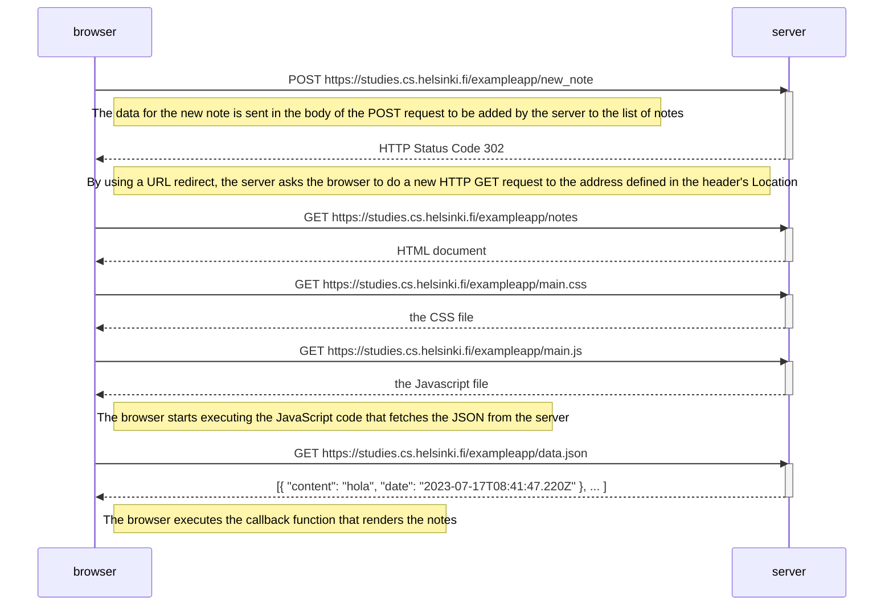

```mermaid
sequenceDiagram
    participant browser
    participant server

    browser->>server: POST https://studies.cs.helsinki.fi/exampleapp/new_note
    activate server
    Note right of browser: The data for the new note is sent in the body of the POST request to be added by the server to the list of notes

    server-->>browser: HTTP Status Code 302
    deactivate server

    Note right of browser: By using a URL redirect, the server asks the browser to do a new HTTP GET request to the address defined in the header's Location 

    browser->>server: GET https://studies.cs.helsinki.fi/exampleapp/notes
    activate server
    server-->>browser: HTML document
    deactivate server 

    browser->>server: GET https://studies.cs.helsinki.fi/exampleapp/main.css
    activate server
    server-->>browser: the CSS file
    deactivate server


    browser->>server: GET https://studies.cs.helsinki.fi/exampleapp/main.js
    activate server
    server-->>browser: the Javascript file
    deactivate server

    Note right of browser: The browser starts executing the JavaScript code that fetches the JSON from the server

    browser->>server: GET https://studies.cs.helsinki.fi/exampleapp/data.json
    activate server
    server-->>browser: [{ "content": "hola", "date": "2023-07-17T08:41:47.220Z" }, ... ]
    deactivate server

    Note right of browser: The browser executes the callback function that renders the notes
```