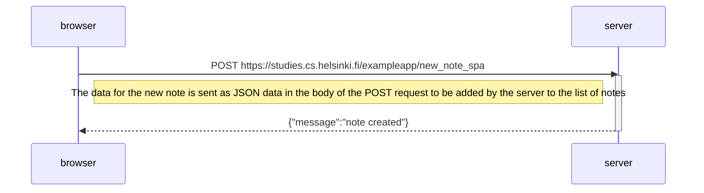

```mermaid
sequenceDiagram
    participant browser
    participant server

    browser->>server: POST https://studies.cs.helsinki.fi/exampleapp/new_note_spa
    activate server
    Note right of browser: The data for the new note is sent as JSON data in the body of the POST request to be added by the server to the list of notes

    server-->>browser: {"message":"note created"}
    deactivate server
```